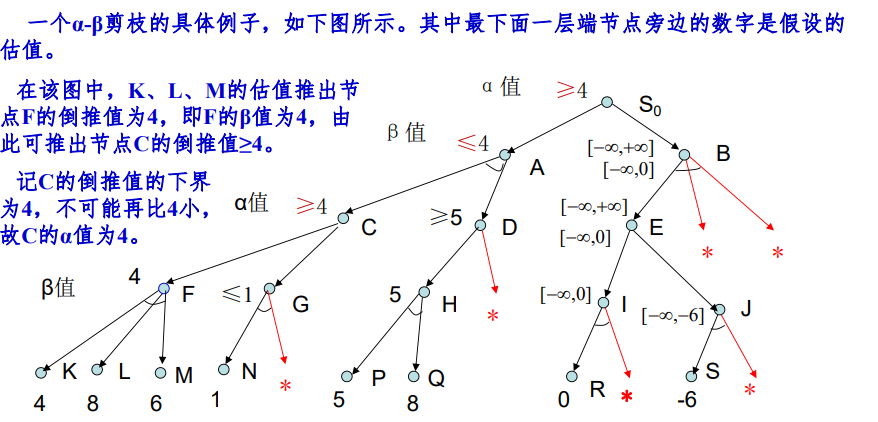
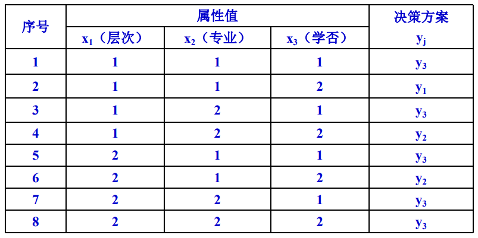

# 历年卷

## 20-21

1. 期望风险最小化，经验风险最小化，结构风险最小化三者的原理及相互关系。设计机器学习的基本原则有哪些。 

2. α-β剪枝，求倒退值，和书上作业题差不多，改了个数据 

3. 主观贝叶斯推理。与作业题3.7基本一致。 

4. 三层BP算法推导 
5. 精确贝叶斯推理。跟书上的例题也差不多，搞明白就都会做了。 

6. ID3，四个属性，两个类别，把书上例题搞明白就会了。感觉没有很难算，熟悉整个流程做起来会很快。

## 19-20

1. α-β剪枝，和书上作业题差不多，改了个数据 

2. 代价树的广度优先搜索，和ppt例题差不多，改了点数据 

3. 模糊运算，就第三章那几个公式，记住就行 

4. BP算法推导，输出层改了下，老师讲课时的输出层只有一个输出，但这次考试的输出层有n个输出，类似这个图

   

5. 精确贝叶斯推理，要学会化简，别头铁硬算，和书上题差不多 

6. 决策树，4个特征，算到手软

## 18-19

1. CNN的结构与优点（400字以内） 
2. BP算法的推导（5层） 
3. α-β剪枝 
4. 代价树的广度优先搜索，要写出每一步的open表和close表并且构建代价树 
5. 贝叶斯精确推理 
6. ID3，有四个属性（其实不难算，可以猜猜先判断哪个属性）

## 17-18

1. 期望风险，经验风险，结构风险的之间的相互关系（把书上那部分抄下来就没啥问题） 
2. 代价树的和代价和最大代价计算（和作业题类似，比作业题稍微长一点，要注意与节点和或节点这两种不同的情况） 
3. 三层神经网络，用bp算法推导参数更新，写整个流程的伪代码（课后一定要自己独立推一边输出层和隐含层的权重更新） 
4. 用ID3算法进行决策并画决策树（和作业题类似，不过这里有4个属性，一个一个算很花时间，能猜一猜节省时间最好） 
5. 概论推理-贝叶斯网络的精确推理（和书上的例题类似，书上例题用的是枚举法，要学会用贝叶斯公式简化计算，不然枚举很花时间） 
6. 证据推理（和书上例题类似）

# 复习

## 第三章

$$
IF \quad E \quad THEN\quad (LS,LN) \quad H
$$

$$
LS = \frac{P(E|H)}{P(E|\neg H)}
$$

$$
L N=\frac{P(\neg E \mid H)}{P(\neg E \mid \neg H)}=\frac{1-P(E \mid H)}{1-P(E \mid \neg H)}
$$

$$
O(X)=\frac{P(X)}{1-P(X)}
$$

$$
O(X)=\frac{P(X)}{P(\neg X)}
$$

$$
P(H \mid S)=P(H \mid E)=\frac{L S \times P(H)}{(L S-1) \times P(H)+1}
$$

$$
P(H \mid S)=P(H \mid \neg E)=\frac{L N \times P(H)}{(L N-1) \times P(H)+1}
$$

$$
P(H \mid S)=P(H \mid E) \times P(E \mid S)+P(H \mid \neg E) \times P(\neg E \mid S)
$$

$$
P(H \mid S)=\left\{\begin{array}{ll}
P(H \mid \neg E)+\frac{P(H)-P(H \mid \neg E)}{P(E)} \times P(E \mid S), & \text { 若 } 0 \leq P(E \mid S)<P(E) \\
P(H)+\frac{P(H \mid E)-P(H)}{1-P(E)} \times[P(E \mid S)-P(E)], & \text { 若 } P(E) \leq P(E \mid S) \leq 1
\end{array}\right.
$$

$$
P(X \mid s)=\alpha P(X, s)=\alpha \sum_{Y} P(X, s, Y)
$$

$$
P(x_1,x_2,...,x_n）=\prod_{i=1}^{n}P(x_i|par(X_i))
$$

### 概率推理

1. 第三章PPT-17页 贝叶斯网络简单应用示例
2. 贝叶斯精确推理：适用于规模较小、结构简单的网络推理（书P109)(PPT-22)
3. 贝叶斯近似推理：复杂网络（先放一放）

### 主观贝叶斯

由逆概率去求原概率

## 第四章

### 解树

在与/或树中，没有子节点的节点称为端节点;本原问题所对应的节点称为终止节点。可见，终止节点一定是端节点，但端节点却不一定是终止节点。

### 广度优先搜索

**思想**
从初始节点S,开始逐层向下扩展，在第n层节点还没有全部搜索完之前，不进入第n+1层节点的搜索。Open表中的节点总是按进入的先后排序，先进入的节点排在前面，后进入的节点排在后面。
**算法**
(1) 把初始节点$S_0$放入Open表中

(2) 如果Open表为空，则问题无解，失败退出

(3) 把Open表的第一个节点取出放入Closed表，并记该节点为n

(4)考察n是否为目标节点。若是，则得到问题的解，成功退出;

(5)若节点n不可扩展，则转第(2)步;

(6) 扩展节点n，将其子节点放入Open表的尾部，并为每一个子节点设置指向父节点的指针，然后转第(2)步。

### 深度优先搜索

在深度优先搜索算法中，最后进人Open表的节点总是排在最前面，即后生成的节点先扩展。

### 代价树的广度优先

代价树的代价:用g(n)表示从初始节点S到节点n的代价，用c(n, n1)表示从父节点n到其子节点n,的代价。这样，对节点n,的代价有
g(n1)=g(n)+c(n, n)。
代价树搜索的目的是为了找到最佳解，即找到一条代价最小的解路径。代价树的广度优先搜索算法:
(1)把初始节点S放入Open表中，置S的代价g(So)=0;(2)如果Open表为空，则问题无解，失败退出;
(3)把Open表的第一个节点取出放入Closed表，并记该节点为
jn;
(4)考察节点n是否为目标。若是，则找到了问题的解，成功退出;(5)若节点n不可扩展，则转第(2)步;
(6)扩展节点n，生成其子节点n(i=1,2,.….)，将这些子节点放入Open表中，并为每一个子节点设置指向父节点的指针。按如下公式:
g(n;)=g (n)+c (n , n;)i=1,2...
计算各子节点的代价，并根据各节点的代价对Open表中的全部节点按由小到大的顺序排序。然后转第(2)步。

### 代价树的深度优先

代价树的深度优先搜索算法和代价树的广度优先搜索算法的步骤也基本相同，它们之间的主要差别在于Open表中的节点排序不同。**在代价树的深度优先搜索算法中，每当扩展一个节点后，仅是把刚生成的子节点按照其边代价由小到大放入Open表的首部，而不需要对Open表中的全部节点再重新进行排序**

### A算法

**全局择优:从Open表的所有节点中选择一个估价函数值最小的进行扩展。
局部择优:仅从刚生成的子节点中选择一个估价函数值最小的进行扩展。**

**全局择优搜索A算法描述:**
(1)把初始节点S放入Open表中，f(So)=g(S)+h(S);(2)如果Open表为空，则问题无解，失败退出;
(3)把Open表的第一个节点取出放入Closed表，并记该节点为
n;
(4)考察节点n是否为目标节点。若是，则找到了问题的解，成功退出;
(5)若节点n不可扩展，则转第(2)步;
(⑥扩展节点n，生成其子节点n;(i=1,2,.….)，计算每一个子节点的估价值f(n;)(i=1,2,.….)，并为每一个子节点设置指向父节点的指针，然后将这些子节点放入Open表中;
(7)根据各节点的估价函数值，对Open表中的全部节点按从小到大的顺序重新进行排序;
(8)转第(2)步。

### A*算法

A\*算法是对A算法的估价函数f(n)=g(n)+h(n)加上某些限制后得到的一种启发式搜索算法
假设f\*(n)是从初始节点S0出发，约束经过节点n到达目标节点Sg的最小代价，估价函数f(n)是对f\*(n)的估计值。记
f*(n)=g\*(n)+h\*(n)
其中,g\*(n)是从S0出发到达n的最小代价，h\*(n)是n到Sg的最小代价。如果对A算法（全局择优）中的g(n)和h(n)分别提出如下限制：

​	第一，g(n)是对最小代价g\*(n)的估计，且g(n)>0;
​	第二，h(n)是最小代价h\*(n)的下界，即对任意节点n均有h(n)≤h\*(n)。则称满足上述两条限制的A算法为A\*算法。

### 解树的代价

(1)若n为终止节点，则其代价h(n)=0;
(2)若n为或节点，且子节点为ng, n2... ,nx，则n的代价为:
h (n ) = min,{c (n , n i )+ h (ni)}
其中，c(n, ni)是节点n到其子节点ni的边代价。
(3)若n为与节点，且子节点为n1,n2,...,nk则n的代价可用和代价法或最大代价法。
若用和代价法，则其计算公式为:h(n )=\sum {c (n , n,)+ h(ni)}
若用最大代价法，则其计算公式为:h(n)= max {c(n,n,)+ h(n,)}
(4)若n是端节点，但又不是终止节点，且n不可扩展，其代价定义为h(n)=co。
(5)根节点的代价即为解树的代价。

### 希望树

### 与/或树启发式搜索

### α-β剪枝

一般而言，第一层为MAX节点，对应α值，对应或树，取子节点的最大倒退值

## 第五章 机器学习

### 统计学习

**经验风险最小化原理**

统计学习是要根据给定的训练样本，求出用联合概率分布函数$P(x, y)$表示的输入变量集x和输出变量集y之间未知的依赖关系，并使期望风险最小。设有n个独立且同分布（即具有相同概率分布)的训练样本
$$
(x_1, y_1), \, (x_2, y_2), \, ..., \, (x_n, y_n)
$$
在一个函数集$\{ f(x, w)\}$中求出一个最优函数$f(x, w0)$，使得系统用该函数对依赖关系进行估计时期望风险
$$
R(w)=\int L(y,f(x, w))dP(x,y)
$$
为最小。
其中，$w$为函数的广义参数;$f (x,w)$为学习函数集（或预测函数集），它可以表示任何函数集，用于从x预测y，目的是通过对训练样本的学习得到一个最优函数$f ( x,w0 )$; $L(y, f( x, w))$为损失函数，表示因预测失误而产生的损失，该函数的具体表示形式与学习问题的类型有关。
对上述期望风险函数，由于其中的概率分布函数P(x, y)未知，因此无法直接对其进行计算。常用的方法是利用经验风险函数
$$
R_{emp}(w) = \frac{1}{n} \sum_{i = 1}^{n}L(y_i,f(x_i,w))
$$
对期望风险进行估计。
经验风险是用样本损失的算术平均值进行计算的。
设计学习算法，使得该经验风险最小化，称为经验风险最小化原理。

**结构风险最小化原理**

统计学习理论研究表明，对线性可分问题可有如下结论:期望风险与经验风险之间以概率（1-）满足如下量化关系:
$$
R(w) \leq R_{emp}(w) + \sqrt{\frac{h(ln(2n/h)+1)-ln(\eta /4)}{n}}
$$
其中，h为VC维，n为样本数，n为满足0≤n<1的参数。可以看出，期望风险由两部分所组成:一是基于样本的经验风险，即训练误差;二是置信范围，即期望风险与经验风险差值的上确界。
后者反映了结构复杂度所带来的风险，它和VC维h及训练样本数有关。当训练样本有限时，VC维越高，经验风险和期望风险的差别就会越大。即对统计学习，不仅要使经验风险最小化，还要降低VC维，以缩小置信范围，进而使期望风险最小化。
据此，结构风险最小化原理可描述如下:同时降低经验风险和置信范围(即VC维)，使期望风险最小化。

### 决策树

决策树是一种由节点和边构成的用来描述分类过程的层次数据结构。根节点:表示分类的开始
叶节点:表示一个实例的结束
中间节点:表示相应实例中的某一属性边:代表某一属性可能的属性值
路径:从根节点到叶节点的每一条路径都代表具体的实例，并且同一路径上的所有属性之间为合取关系，不同路径（即一个属性的不同属性值）之间为析取关系。
决策树的分类过程:从树的根节点开始，按照给定的实例的属性值去测试对应的树枝,并依次下移，直至到达某个叶节点为止。

#### ID3

**信息熵**
$$
E(S) = - \sum_{j = 1}^{k}P(y_j)logP(y_j)
$$
**加权信息熵**
$$
E(S,x_i) = \sum_{t = 1}^{r}\frac{|S_t|}{|S|} \times\\
$$
$t$为条件属性$x_i$的属性值，$S_t$为$x_i = t$时的样本子集，$|S|$为样本个数

**信息增益**
$$
G(S,x_i) = E(S) - E(S,x_i)
$$
ID3算法的学习过程是一个以整个样本集为根节点，以信息增益最大为原则，选择条件属性进行扩展，逐步构造出决策树的过程。若假设S={S,S2..…S}为整个样本集，X={X,X....Xm}为全体属性集，Y={y1y…y为样本类别。则ID3算法描述如下:
(1)初始化样本集S={S1,S2.…S}和属性集X={X,…Xm}，生成仅含根节点（S, X)）的初始决策树。
(2)如果节点样本集中的所有样本全都属于同一类别，则将该节点标记为叶节点，并标出该叶节点的类别。算法结束。否则执行下一步。
(3)如果属性集为空;或者样本集中的所有样本在属性集上都取相同值，即所有样本都具有相同的属性值，则同样将该节点标记为叶节点，并根据各个类别的样本数量，按照少数服从多数的原则，将该叶节点的类别标记为样本数最多的那个类别。算法结束。否则执行下一步。
(4)计算每个属性的信息增益，并选出信息增益最大的属性对当前决策树进行扩展。
(5)对选定属性的每一个属性值，重复执行如下操作，直至所有属性值全部处理完为止:
①为每一个属性值生成一个分支;并将样本集中与该分支有关的所有样本放到一起，形成该新生分支节点的样本子集;
若样本子集为空，则将此新生分支节点标记为叶节点，其节点类别为原样本集中最多的类别;
⑧否则，若样本子集中的所有样本均属于同一类别，则将该节点标记为叶节点，并标出该叶节点的类别。
(6)从属性集中删除所选定的属性，得到新的属性集。
(7)转第(3)步。

例子

假设将决策y分为以下3类:y:必修AI y:选修AI y:不修AI
做出这些决策的依据有以下3个属性::

学历层次 x=1研究生，x=2本科:

专业类别 x=1电信类, x=2机电类:

学习基础 x=1修过AI, x3=2未修AI

## 第六章

### BP

